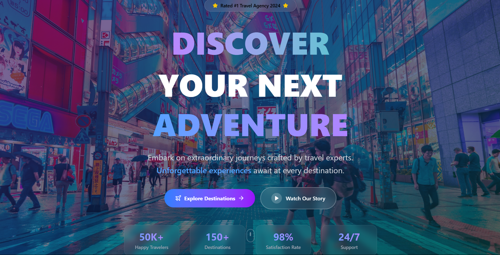

# 🌍 Travel Agency - Dark Themed Home Screen

A modern, fully responsive, dark-themed homepage for a travel agency website built with **React** and **Tailwind CSS**. This project showcases elegant layout design, mobile-first responsiveness, and visual storytelling for a travel-focused brand.

  

---

## 🚀 Features

- 🌑 **Dark Theme** with elegant gradients and imagery.
- 🎯 Hero section with catchy tagline and CTA buttons.
- 🗺️ Popular Destinations with cards and responsive layout.
- ✅ “Why Choose Us” features with modern icons.
- 💬 Optional Testimonials section.
- 🔗 Modern Footer with newsletter signup and map overlay.

---

## 🛠️ Tech Stack

- [React JS](https://reactjs.org/)
- [Tailwind CSS](https://tailwindcss.com/)
- [Lucide React Icons](https://www.npmjs.com/package/lucide-react)

---

## 📂 Folder Structure

```text
├── public/
│   ├── assets/             # Static images (e.g., background, destinations)
│   └── index.html
├── src/
│   ├── components/         # Reusable components (Hero, Destinations, Footer, etc.)
│   │   ├── Hero.jsx
│   │   ├── Destinations.jsx
│   │   ├── WhyChooseUs.jsx
│   │   ├── Testimonials.jsx
│   │   └── Footer.jsx
│   ├── App.jsx             # Main app container
│   ├── main.jsx            # React DOM root
│   └── index.css           # Tailwind directives and base styles
├── tailwind.config.js      # Tailwind configuration
├── postcss.config.js
├── package.json
└── README.md               # You are here 📘

